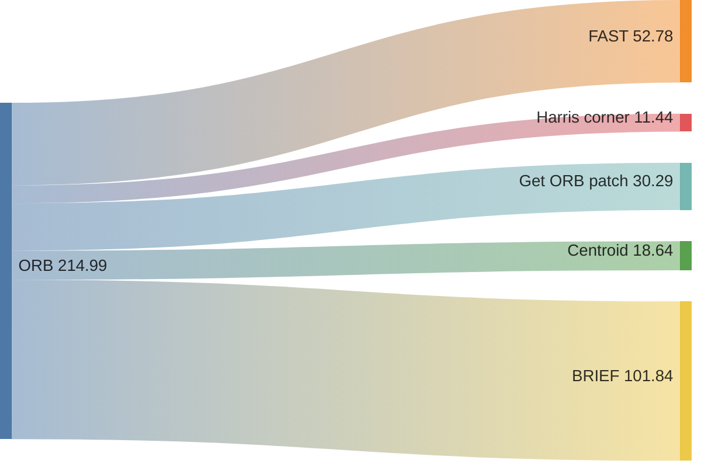

# ORB implementation on STM32U575ZI-Q
A from-scratch implementation of the ORB (Oriented FAST and Rotated BRIEF) computer vision algorithm for the STM32U575ZI-Q. The project started as a naive working implementation and is currently focused on optimizing performance.

- [What?](#What)
- [Why?](#Why)
- [Profiling](#Profiling)
- [Hardware](#Hardware)
- [Progress](#Progress)
- [Running](#Running)
- [Performance](#Performance)
- [Roadmap](#Roadmap)

## What?
This project implements the ORB feature detection and description algorithm in STM32CubeIDE, targeting 320×240 images.

The implementation uses the DWT cycle counter for cycle-accurate performance measurements. Serial Wire Viewer (SWV) is used to output profiling and benchmark results through STM32CubeIDE.

Each branch contains the current best implementation of a specific stage of the ORB pipeline. Commits include profiling information showing how each change affects performance.

## Why?
I started this project after reading this [research article](https://www.mdpi.com/1424-8220/25/12/3796). I wanted to try implementing a similar approach myself and explore how a computer vision algorithm such as ORB could be optimized for a resource-constrained embedded system.

## Profiling

The **DWT cycle counter** is used to measure the number of CPU cycles between instrumentation points in the code. These measurements are then aggregated and displayed through **Serial Wire Viewer (SWV)** in STM32CubeIDE.

There is a known limitation to this approach: the cycles required to store and process the profiling data are also included in the measurements. As a result, the more granular the measurements become, the larger the relative measurement overhead.

This is also the reason for the **"unknown"** category shown in the commit profiling results. It provides a rough indication of how many cycles are spent outside the measured ORB stages, including profiling and other system overhead.

**Unknown = Total measured cycles - Sum of instrumented stage**

## Progress
| ORB stage | Status |
|------|-------------|
| Gaussian blur | Not implemented |
| FAST | Optimized | 
| Harris corner | Optimized |
| Image Centroid | Optimized  |
| BRIEF | Work in progress | 

## Hardware

- **MCU:** STM32U575ZI-Q
- **Image resolution:** 320×240
- **IDE:** STM32CubeIDE 2.0.0
- **Compiler:** ARM GCC
- **CPU frequency:** 160 MHz
- **Performance counter:** DWT
- **Output:** Serial Wire Viewer (SWV)
- **Board:** NUCLEO-U575ZI-Q

## Running

1. Open the project in STM32CubeIDE.
2. Connect an STM32U575ZI-Q development board.
3. Build the project.
4. Flash the firmware.
5. Start a debug session.
6. Open the SWV/ITM console to view the profiling results.

## Performance
Measurements are average execution times.
> Measurements are normalized to the unit shown in the **Measurement** column and are therefore not directly comparable across stages.

**Speedup = Naive execution time / Current execution time**

| ORB stage | Naive | Current | Speedup|  Measurement| 
|------|-------------|--------|--------|--------|
| Gaussian blur | — | — | — | —
| FAST | 4.75 us | 0.5 us | 9.5× |Per pixel|
| Harris corner | 210.56 us | 12.29 us | 17.13× | Per FAST keypoint|
| Image Centroid |  384.68 us | 26.24 us | 14.66× | Per keypoint |
| BRIEF | 399.81 us  | — | — | — |

Performance diagram (ms)

This diagram is from the raw data below, where each component has been split into its own own category to visualize the time spent distribution. 

Unaccounted is excluded since it is if adding up the rest it gets to 214ms and with no profiling its is 210ms, hence this is a decent representation of the current state.

Latest raw data 

Is feature point = the small check to ensure valid.

Get ORB Patch = the 31x31 patch around the feature point for Centroid and Brief to work on.

================== Overview ===============

feat: 
perf: 

Performance baseline (700 keypoints, -O3, 160MHz)
- Total:            295ms
- FAST:             53ms ( 17.9%)
- Is feature point  0ms (  0.1%)
- Harris:           11ms (  3.9%)
- Get ORB patch     30ms ( 10.3%)
- unaccounted       200ms ( 67.9%)

=== Configs ====

FAST:     threshold (t) 50, n = 12

Harris:   K 0.040000, harris window size = 7

Centroid: None

rBRIEF:   None

================== ORB Results ===============

number of keypoints: 700

===  us  ===

| Part                        |         min |         max |     average |   aggregate |     % total|
|-----------------------------|-------------|-------------|-------------|-------------|------------|
| ORB                         |   294826.02 |   294826.02 |   294826.02 |   294826.02 |      100.00
| FAST                        |        0.50 |        2.64 |        0.50 |    52781.64 |       17.90
| Is feature point            |        0.14 |        0.19 |        0.14 |      156.06 |        0.05
| Harris                      |       12.29 |       13.67 |       12.29 |    11443.26 |        3.88
| Get ORB patch               |       43.23 |       44.28 |       43.23 |    30294.37 |       10.28
| Centroid                    |       25.85 |       27.91 |       26.27 |    18641.72 |        6.32
| rBRIEF                      |      138.43 |      148.86 |      144.43 |   101844.02 |       34.54

===  ms  ===

| Part                        |         min |         max |     average |   aggregate |     % total|
|-----------------------------|-------------|-------------|-------------|-------------|------------| 
| ORB                         |      294.83 |      294.83 |      294.83 |      294.83 |      100.00
| FAST                        |        0.00 |        0.00 |        0.00 |       52.78 |       17.90
| Is feature point            |        0.00 |        0.00 |        0.00 |        0.16 |        0.05
| Harris                      |        0.01 |        0.01 |        0.01 |       11.44 |        3.88
| Get ORB patch               |        0.04 |        0.04 |        0.04 |       30.29 |       10.28
| Centroid                    |        0.03 |        0.03 |        0.03 |       18.64 |        6.32
| rBRIEF                      |        0.14 |        0.15 |        0.14 |      101.84 |       34.54

=====================================================================

## Roadmap

- [ ] Fix FAST all-pass bug
- [ ] Implement Gaussian blur
- [ ] Optimize memory by storing a 31 x Image width block
- [ ] Complete BRIEF implementation
- [ ] Profile and optimize FAST using assembly

